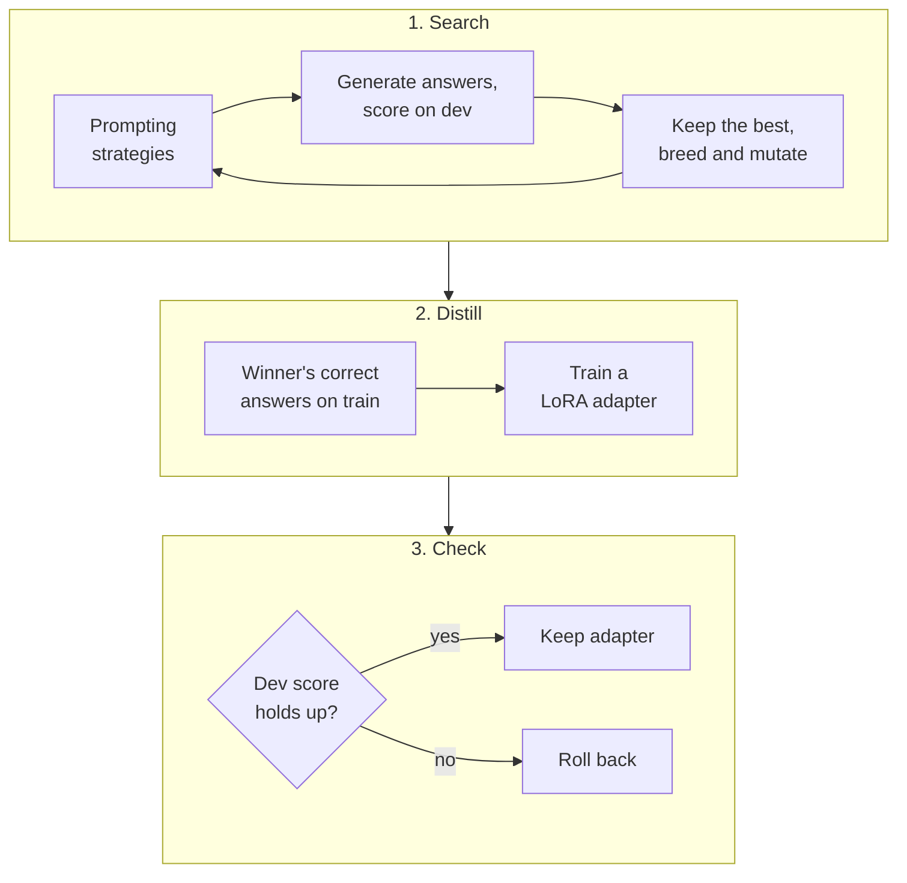

# MACD: Meta-Adaptive Context Distillation

[](https://github.com/bobathefetts/MACD/actions/workflows/ci.yml)

[](LICENSE)
[](https://github.com/astral-sh/ruff)

**Find the best way to prompt a language model. Then teach the model to do it without the prompt.**

MACD is a small research framework that runs one loop: it *evolves* prompting strategies for a task,
keeps the winners, and *distills* the best one into a LoRA adapter, so the model behaves that way on a
plain prompt. An adapter is only kept if it measurably helps.

It runs on a laptop with no GPU in a couple of seconds (mock backend), against any local model server
(vLLM, Ollama, llama.cpp), or in-process with Hugging Face Transformers and real LoRA fine-tuning.



## The idea in plain English

Getting good answers out of a language model usually takes scaffolding: a carefully worded instruction,
a handful of worked examples, a "think step by step" nudge, the right sampling settings. That scaffolding
costs tokens on every single call, and finding a good combination is trial and error.

MACD automates both halves:

1. **Search.** Treat a prompting setup as a set of dials (prompt style, how many examples to show and how
   to pick them, temperature, and so on). Start with random settings, score each on held-back questions,
   keep the best, and breed new variations from them. Repeat.
2. **Distill.** Take the winning setup, collect the questions it answers correctly, and fine-tune a small
   LoRA adapter so the model gives those answers from a bare prompt. The scaffolding moves from the prompt
   into the weights.
3. **Check.** Re-score with the adapter switched on. If the score dropped, throw the adapter away.

Then the loop runs again on top of the improved model.

## Try it in 60 seconds (no GPU needed)

```bash
git clone https://github.com/bobathefetts/MACD.git
cd MACD
python -m venv .venv
. .venv/bin/activate            # Windows: .venv\Scripts\activate
pip install -e ".[dev]"

macd doctor                      # checks your environment
macd cycle --task-config configs/tasks/qa.yaml --model-config configs/models/local.yaml --cycles 2
```

You should see something like this:

```text
=== CYCLE 1/2 ===
=== CYCLE 2/2 ===
                              MACD run (mock backend)
 cycle     dev    test (95% CI)      adapter  distillation        style    shots
 baseline  0.250  -                  -        -                   concise  0
 1         0.417  0.250 (0.00-0.50)  macd-r1  accepted            bullet   6
 2         0.417  0.250 (0.00-0.50)  macd-r1  no dev improvement  bullet   6
Run saved to outputs/run-20261006-151900
```

This first run uses the **mock backend**, a toy stand-in for a model that exists to prove the loop works.
Its scores mean nothing about real models. Notice what the table shows anyway: the dev score rose because
strategies were *chosen* on dev, while the untouched test score did not move. That gap is why MACD keeps a
separate test split and reports it every cycle.

## What makes it different

- **Search, then distill.** Prompt-optimization tools stop at a better prompt. Fine-tuning tools start from
  data you already have. MACD connects them: the search produces the training data.
- **Adapters have to earn their place.** Every trained adapter is re-scored on dev and rolled back if it
  made things worse.
- **Built to not fool you.** Train, dev and test are separate and the run refuses to start if they overlap.
  The test split is never used for a decision. Test scores carry 95% confidence intervals. Same seed, same
  result.
- **One loop, three backends.** Develop against the mock, search against a local server, fine-tune
  in-process. The model YAML is the only thing that changes.
- **Small enough to read.** About 1,350 lines of Python. No framework to learn.

## Backends

| Config | Backend | Generation | LoRA training | Needs |
|---|---|---|---|---|
| `configs/models/local.yaml` | `mock` | nearest-neighbour toy model | memorises examples | nothing |
| `configs/models/endpoint.yaml` | `openai_compat` | any OpenAI-compatible server (vLLM, Ollama, llama.cpp, LM Studio) | optional, via a local PEFT trainer | a running server |
| `configs/models/hf_lora.yaml` | `hf` | in-process Transformers, batched | real PEFT LoRA, optional 4-bit loading | `pip install -e ".[hf,quant]"` and a GPU |

### Run against a local model server

```bash
# with vLLM, Ollama or llama.cpp already serving on port 8000
macd cycle --task-config configs/tasks/qa.yaml --model-config configs/models/endpoint.yaml
```

Edit `base_url` and `model` in `configs/models/endpoint.yaml` to match your server. API keys are read from
the environment variable named in `api_key_env`, never from YAML. Out of the box this runs the strategy
search only. To distill as well, uncomment the `trainer` block: adapters are then trained locally with
PEFT and hot-loaded into vLLM.

### Run in-process with LoRA fine-tuning

```bash
pip install -e ".[hf,quant]"
macd cycle --task-config configs/tasks/qa.yaml --model-config configs/models/hf_lora.yaml
```

- `model_id` accepts any causal LM on the Hugging Face Hub or a local folder. The shipped default,
  `meta-llama/Llama-3.1-8B-Instruct`, is gated: accept its license on the Hub and run `hf auth login` first.
- For air-gapped machines, pre-stage the model folder and set `local_files_only: true`.
- `load_in_4bit: true` uses bitsandbytes (QLoRA-style) and needs an NVIDIA GPU.

## Bring your own data

Data files are JSON Lines, one example per line:

```json
{"prompt": "Is iron a metal?", "answer": "yes"}
```

Point a task config at three files:

```yaml
task:
  name: my_task
  type: qa                      # or: summarization
  data:
    train_path: data/my_task/train.jsonl   # few-shot pool + distillation source
    dev_path: data/my_task/dev.jsonl       # strategy selection + adapter gating
    test_path: data/my_task/test.jsonl     # held out; reporting only
```

| Split | Used for |
|---|---|
| `train` | few-shot exemplar pool, and the only source of distillation data |
| `dev` | selecting strategies, accepting or rolling back adapters |
| `test` | reporting only; never touched by any decision |

## What gets evolved

```yaml
generation: {temperature: 0.0-1.5, top_p: 0.1-1.0, max_new_tokens: 16-256}
retrieval:  {k: 0-8 few-shot exemplars, selector: random | similar}
training:   {lr: 1e-5 to 5e-4 (log scale), rank: 4 | 8 | 16 | 32, steps: 20-400}
prompt_style: concise | cot | bullet | json
```

Every gene changes behaviour. The `training` genes are the LoRA hyperparameters used when that strategy
is distilled, so the search tunes fine-tuning settings along with the prompt.

## What a run produces

Each `cycle` or `evolve` run writes to `outputs/run-<timestamp>/` (override with `--run-dir`):

- `config.json`: the exact task config, model config and seed
- `events.jsonl`: one line per generation, distillation and cycle
- `history.json`: per-cycle dev score, test score with confidence interval, and the winning strategy
- `adapters/macd-r<N>/`: the trained adapter for each round, loadable with PEFT or vLLM

## Project status

This is an early research framework, shared so others can try it, break it and improve it.

**Verified by the test suite (51 tests; CI runs them on Python 3.10 to 3.13, plus a job that does real LoRA training on CPU):**

- the full loop on the mock backend, including reproducibility, caching, leakage rejection and adapter rollback
- the endpoint client against a simulated server (request format, ordering, retries, error handling)
- real LoRA training through the Hugging Face backend on a tiny Llama built inside the test: the adapter
  learns its targets, swaps in and out cleanly, and reloads with plain PEFT

**Not yet verified:**

- a full-size model on a GPU
- 4-bit loading with bitsandbytes
- a live vLLM server and runtime adapter loading
- any result on a real benchmark. There are no performance claims here yet.

**Known limitations:**

- The bundled datasets are toys (12 dev and 12 test questions), so confidence intervals on them are wide.
- The summarization metric is unigram F1, a rough proxy for ROUGE-1.
- Each distillation round trains a fresh adapter from the base model on all curated samples so far.
  Adapters are not stacked.

## Roadmap and help wanted

Contributions are welcome. The most useful ones right now:

- **First real results.** Run a cycle on an open model with a public dataset and share `history.json`.
- **Real task adapters.** Classification, extraction, multi-hop QA, code.
- **Better metrics.** ROUGE and BERTScore for summarization, an LLM judge as a reward model.
- **Smarter search.** Bandit-style early stopping for weak strategies, larger gene space.
- **Shakedown reports.** vLLM hot-loading, bitsandbytes on different GPUs, Apple silicon.

See [CONTRIBUTING.md](CONTRIBUTING.md) to get set up.

## Repository layout

```
macd/
  main.py              CLI: evaluate, evolve, cycle, doctor
  config.py            validated YAML config (typos fail at startup)
  core/
    controller.py      the loop: evolve, distill, gate, report
    evolution.py       strategy genome, mutation, crossover
    evaluator.py       metrics and bootstrap confidence intervals
    retrieval.py       few-shot exemplar selection
    trainer.py         curated-sample store and distillation
    reward.py          sample reward (swap in a learned reward model here)
    tracking.py        run logging
  backends/            mock, openai_compat, hf
  adapters/            per-task prompts and answer extraction (qa, summarization)
configs/               task and model YAML
data/                  toy QA and summarization sets with train/dev/test splits
tests/                 pytest suite
```

## Extending

- **New task:** subclass `TaskAdapter` in `macd/adapters/`, register it in `ADAPTERS`, and add its name to the `type` field in `macd/config.py`.
- **New backend:** subclass `Backend` in `macd/backends/` and register it in `build_backend`.
- **Learned reward:** replace `simple_reward` in `macd/core/reward.py`; keep the signature.

## Development

```bash
pip install -e ".[dev]"
ruff check . && ruff format --check .
pytest
```

The Hugging Face backend tests run only when `torch`, `transformers` and `peft` are installed; otherwise
they are skipped.

## License

MIT. See [LICENSE](LICENSE).
